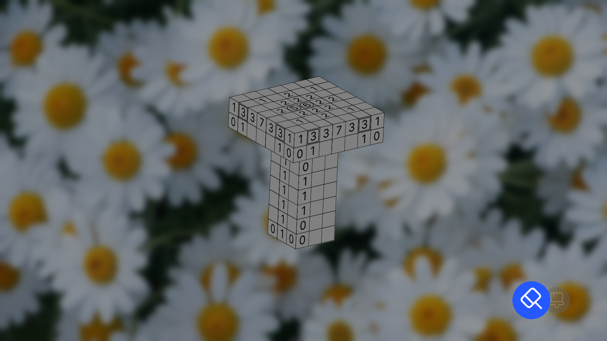
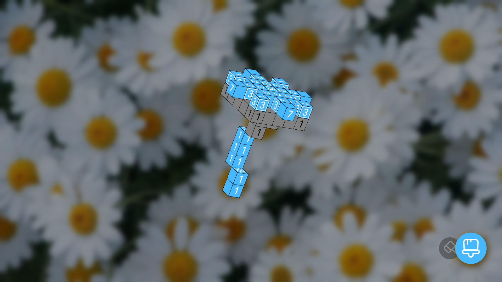
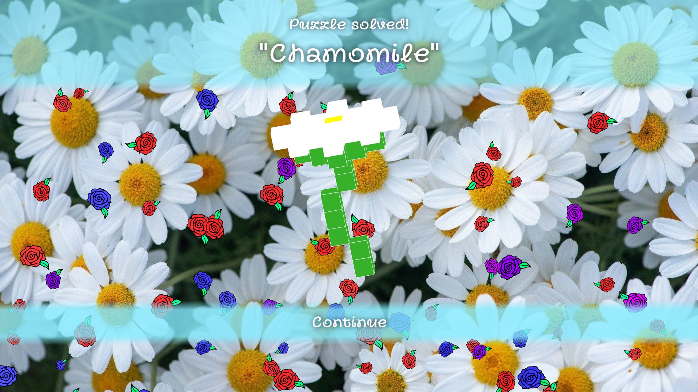

# Picross 3D: Web Edition (React + TypeScript, NO CANVAS)

Web-адаптация Picross 3D без использования Canvas. Все 3D-поверхности являются обычными div'ами. 
Изначальная цель — проверить границы возможностей 3D-трансформаций HTML-элементов.
# Как выглядят головоломки:

*Цифры означают количество кубиков в ряду, которые нужно оставить
# Почти одуванчик

*Кубики можно красить, чтобы случайно их не удалить
# Уже одуванчик!

*После удаления всех лишних блоков головоломка считается пройденной